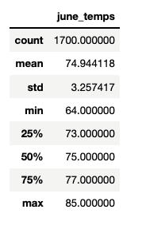
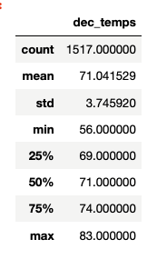

# Surfs Up
## Overview
For our ninth data analysis project we were tasked with doing an analysis of weather patterns in Oahu to help W. Avy determine if the weather would be condusive to a surf and ice cream shop year round.  Using a weather database stored in the file based database SQLLite and the new python tool sqlalchemy, we did an analysis of the temperatures from different weather stations on Oahu.  For the module, we looked at the average temperatures for the 12 months prior to the analysis date.  Additionally, we looked at historic temperatures in both June and December for all the years with data provided in our database.  
## Results
June Statistics 
- Average June Temp is 75 degrees
- 75% of the days are above 73 degrees
- low temp is 64 degrees and high temp is 85 degrees

 

December Statistics
- Average June Temp is 71 degrees
- 75% of the days are above 69 degrees
- low temp is 54 degrees and high temp is 83 degrees

 
## Summary 
It seems from the data that Oahu would be a good place for a surf and ice cream shop.  More than 75% of the time, the temperature is above 70 degrees.  With the data available, I would add additional queries to check for the average daily precipitation by month, as well the statistics for temperatures for all the months.  I would like to see the comparison of rain with temperatures to find out if it rains more in the colder months, of it's it a warmer rain during the hotter times.  People might be more likely to come out during the rain if it's still fairly warm.  Also, I might want to query for the number of days per month without rain.  
